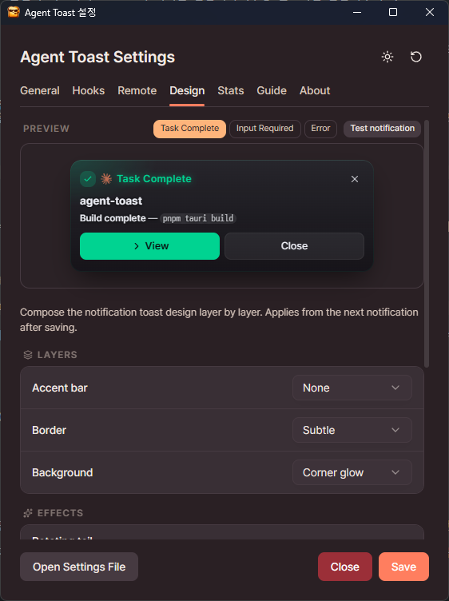
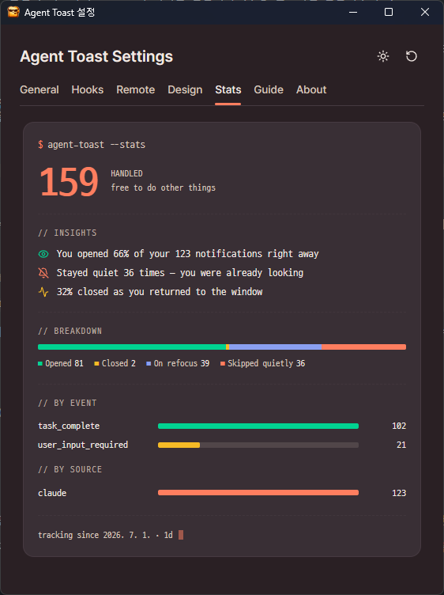
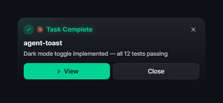

<p align="center">
  <a href="README.md">한국어</a> | <strong>English</strong>
</p>

<p align="center">
  
</p>

<h1 align="center">Agent Toast</h1>

<p align="center">
  <strong>No more babysitting the terminal</strong><br>
  Agent Toast pings you the instant your agent needs you, then clicks you right back
</p>

<p align="center">
  <a href="https://github.com/hopoduck/agent-toast/releases"></a>
  <a href="https://github.com/hopoduck/agent-toast/blob/master/LICENSE"></a>
  
  
</p>

<p align="center">
  
</p>

## ✨ Features

- **Smart Notifications** - Click to activate terminal, auto-dismiss on focus return, skip if already focused
- **Agent Message Display** - Optionally show the agent's last message (or the tool description on permission requests) as the notification body
- **15 Hook Events** - Task completion, permission requests, input waiting, session start/end, and more
- **Remote Notifications** - Receive Claude Code hook notifications from remote Linux servers as desktop toasts
- **Multi-Monitor Support** - Display notifications on any corner of your preferred monitor with DPI scaling
- **Notification Sound** - System alert sound so you never miss an event (toggleable in settings)
- **Light/Dark Theme** - Toast design follows your system theme; hover to pause auto-dismiss
- **Toast Design Customization** - Tune bar, border, background, effects, and density (comfortable/compact) plus sans/mono system fonts with a live preview (D2Coding bundled)
- **Notification Stats** - Aggregated counts and insights for shown / clicked / auto-dismissed events
- **Multilingual UI** - Korean/English support
- **Auto Update** - New version notifications with one-click update

## 🖼️ Screenshots

|                               Toast Design Customization                               |                                    Notification Stats                                    |
| :-------------------------------------------------------------------------------------: | :-----------------------------------------------------------------------------------------: |
|  |  |

## 🔌 Supported Platforms

| Platform                                             | Description                          |
| ---------------------------------------------------- | ------------------------------------ |
| [Claude Code](https://www.anthropic.com/claude-code) | Anthropic's AI coding assistant      |
| [Codex CLI](https://openai.com/codex/)               | OpenAI's terminal-based coding agent |

## 📥 Installation

### Download from Releases

[**📦 Download Latest Version**](https://github.com/hopoduck/agent-toast/releases/latest)

### Build from Source

```bash
# Requirements: Node.js 18+, pnpm, Rust (MSVC toolchain)

pnpm install
pnpm tauri build
```

## 🚀 Usage

### 1. Open Settings

```bash
agent-toast.exe --setup
```

Or right-click the system tray icon → Settings

### 2. Configure Hooks

Enable desired events in the settings window to automatically register hooks.

> 💡 By default the notification body shows the agent's last message (or the tool description on permission requests). Turn off **Use Agent's Message** in the General tab to show each hook's fixed text instead.

| Platform    | Config File               |
| ----------- | ------------------------- |
| Claude Code | `~/.claude/settings.json` |
| Codex CLI   | `~/.codex/config.toml`    |

## ⚙️ How It Works

- Single-instance management via Named Pipe — first launch starts the app, subsequent CLI calls send JSON through the pipe and exit immediately
- Real-time focus detection via Win32 API for automatic notification dismissal
- Process tree traversal from `--pid` for improved terminal window detection accuracy

## 🌐 Remote Notifications (Linux Servers)

Receive Claude Code hook notifications from a remote Linux server as desktop toasts.

<details>
<summary><strong>Setup instructions</strong></summary>

### 1. Desktop: Enable HTTP Receiver

Settings window → **Remote Notifications** → toggle **Enable HTTP receiver** ON. The default port is `38787` (changeable in settings); the bind address is always `0.0.0.0`.

Windows Firewall may prompt for permission on first use. If you're using Tailscale or SSH port forwarding, allowing **private networks** only is sufficient.

### 2. Server: Install `agent-toast-send` + Register Hooks

```bash
curl -L https://github.com/hopoduck/agent-toast/releases/latest/download/agent-toast-send-linux-$(uname -m) \
  -o ~/.local/bin/agent-toast-send
chmod +x ~/.local/bin/agent-toast-send

agent-toast-send init --url http://<desktop-ip>:38787 --dynamic [--hostname "prod"]
```

- `<desktop-ip>` is the address reachable from the server to your desktop (Tailscale, LAN, SSH `-R`). Network reachability is the user's responsibility and is not managed by the app.
- `--dynamic` shows the agent's last message (or the tool description on permission requests) as the notification body (omit for fixed text).
- `--hostname` sets the label shown in the toast (omit to auto-detect via `hostname(1)`).
- Default hooks registered: **Stop** (task completion), **Notification** (permission request). For finer customization, edit `~/.claude/settings.json` on the server directly.

To uninstall, run `agent-toast-send uninstall` — only removes agent-toast related hooks; all other hooks are preserved.

</details>

## 🌍 Global stats (anonymous)

The app anonymously uploads notification counters (shown/clicked/closed counts) to an aggregation server and shows worldwide totals in the stats tab and the badge above.

- **Sent**: cumulative per-event/source counters and a random ID generated at install
- **Never sent**: hostname, file paths, message contents, or anything identifying
- **Opt out**: Settings → Stats tab → "Share anonymous stats" toggle

## 🤔 Why a custom notification window?

OS-native toasts only *show* a notification. Agent Toast makes the notification part of your **workflow**:

<p align="center">
  
</p>

- **One click back to that terminal** — clicking the toast activates the exact terminal window that raised it
- **Auto-dismiss on return** — the toast closes itself when focus returns to the terminal
- **Skips when unneeded** — no toast if you're already looking at that terminal

A dedicated window enables this window-aware smart behavior that native toasts can't do.

## 🔍 Comparison with Other Notification Tools

|                                  | **Agent Toast**                 | [**Toasty**](https://github.com/shanselman/toasty) | [**claude-code-notification**](https://github.com/wyattjoh/claude-code-notification) | **PowerShell Script** | [**ntfy.sh**](https://ntfy.sh) |
| -------------------------------- | ------------------------------- | -------------------------------------------------- | ------------------------------------------------------------------------------------ | --------------------- | ------------------------------ |
| **Notification Style**           | Custom notification window      | OS native toast                                    | OS native toast                                                                      | OS native toast       | HTTP push notification         |
| **Platform**                     | Windows                         | Windows                                            | Windows · macOS · Linux                                                              | Windows               | All (incl. mobile)             |
| **Installation**                 | Installer / Portable            | CLI binary                                         | CLI binary                                                                           | Copy script           | One-line curl                  |
| **GUI Settings**                 | ✅ Settings window               | ❌ CLI only                                         | ❌ CLI only                                                                           | ❌ Manual edit         | ❌ Manual edit                  |
| **Design Customization**         | ✅ Bar, fonts, density, etc.     | ❌                                                  | ❌                                                                                    | ❌                     | ❌                              |
| **Notification Stats**           | ✅                               | ❌                                                  | ❌                                                                                    | ❌                     | ❌                              |
| **Smart Notifications**¹         | ✅                               | ❌                                                  | ❌                                                                                    | ❌                     | ❌                              |
| **Click → Activate Terminal**    | ✅                               | ❌                                                  | ❌                                                                                    | ❌                     | ❌                              |
| **Multi-Monitor · Position**     | ✅ 4 corners + monitor           | ❌                                                  | ❌                                                                                    | ❌                     | ❌                              |
| **DPI Scaling**                  | ✅                               | ❌                                                  | ❌                                                                                    | ❌                     | ❌                              |
| **Notification Sound**           | ✅                               | ❌                                                  | ✅                                                                                    | ❌                     | ✅                              |
| **Auto Update**                  | ✅                               | ❌                                                  | ❌                                                                                    | ❌                     | ❌                              |
| **Remote Server Notifications**² | ✅ Dedicated CLI + HTTP receiver | ❌                                                  | ❌                                                                                    | ❌                     | ✅                              |
| **Mobile Notifications**         | ❌                               | ✅ (via ntfy)                                       | ❌                                                                                    | ❌                     | ✅                              |
| **Multi AI Tool Support**        | Claude Code · Codex CLI         | Claude · Copilot · Gemini · Codex, etc.            | Claude Code                                                                          | Claude Code           | Universal                      |
| **Language**                     | Rust + TypeScript               | C++                                                | Rust                                                                                 | PowerShell            | Shell (curl)                   |

> ¹ **Smart Notifications**: Skip notification if terminal is already focused + auto-dismiss when terminal regains focus
>
> ² **Remote Server Notifications**: Agent hooks running on a remote Linux server show toasts on your desktop (Toasty's ntfy integration is desktop→mobile outbound only)

## 🛠️ Tech Stack

<p>
  
  
  
  
</p>

## 📄 License

[MIT License](LICENSE)
