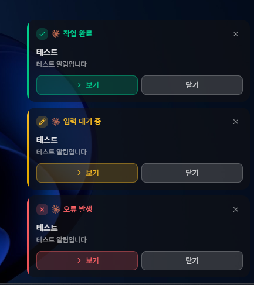

<p align="center">
  <strong>한국어</strong> | <a href="README.en.md">English</a>
</p>

<p align="center">
  
</p>

<h1 align="center">Agent Toast</h1>

<p align="center">
  <strong>Windows용 스마트 데스크톱 알림 앱</strong><br>
  AI 코딩 어시스턴트의 이벤트를 놓치지 마세요
</p>

<p align="center">
  <a href="https://github.com/hopoduck/agent-toast/releases"></a>
  <a href="https://github.com/hopoduck/agent-toast/blob/master/LICENSE"></a>
  
</p>

---

## ✨ 주요 기능

- **스마트 알림** - 알림 클릭 → 터미널 즉시 활성화, 터미널 복귀 시 알림 자동 소멸, 이미 포커스 중이면 알림 생략
- **15가지 Hook 이벤트** - 작업 완료, 권한 요청, 입력 대기, 세션 시작/종료 등
- **멀티 모니터 지원** - 원하는 모니터의 4코너에 알림 표시, DPI 스케일 대응
- **알림 사운드** - 시스템 알림음으로 이벤트를 놓치지 않음 (설정에서 on/off)
- **다국어 지원** - 한국어/영어 UI
- **자동 업데이트** - 새 버전 알림 및 원클릭 업데이트

## 📸 스크린샷

<p align="center">
  
</p>

## 🔌 지원 플랫폼

| 플랫폼                                               | 설명                               |
| ---------------------------------------------------- | ---------------------------------- |
| [Claude Code](https://www.anthropic.com/claude-code) | Anthropic의 AI 코딩 어시스턴트     |
| [Codex CLI](https://openai.com/codex/)               | OpenAI의 터미널 기반 코딩 에이전트 |

## 📥 설치

### Releases에서 다운로드

[**📦 최신 버전 다운로드**](https://github.com/hopoduck/agent-toast/releases/latest)

### 직접 빌드

```bash
# 요구사항: Node.js 18+, pnpm, Rust (MSVC 툴체인)

pnpm install
pnpm tauri build
```

## 🚀 사용법

### 1. 설정 창 열기

```bash
agent-toast.exe --setup
```

또는 시스템 트레이 아이콘 우클릭 → 설정

### 2. 훅 설정

설정 창에서 원하는 이벤트를 활성화하면 자동으로 훅이 등록됩니다.

| 플랫폼      | 설정 파일                 |
| ----------- | ------------------------- |
| Claude Code | `~/.claude/settings.json` |
| Codex CLI   | `~/.codex/config.toml`    |

## ⚙️ 작동 원리

- Named Pipe로 단일 인스턴스 관리 — 최초 실행 시 앱을 띄우고, 이후 CLI 호출은 파이프로 JSON 전송 후 즉시 종료
- Win32 API로 포커스 변화를 실시간 감지하여 알림 자동 소멸 처리
- 프로세스 트리 탐색으로 `--pid`에서 터미널 창 탐지 정확도 개선

## 🔍 다른 알림 도구와 비교

| | **Agent Toast** | [**Toasty**](https://github.com/shanselman/toasty) | [**claude-code-notification**](https://github.com/wyattjoh/claude-code-notification) | **PowerShell 스크립트** | [**ntfy.sh**](https://ntfy.sh) |
| --- | --- | --- | --- | --- | --- |
| **알림 방식** | 커스텀 알림 창 | OS 네이티브 토스트 | OS 네이티브 토스트 | OS 네이티브 토스트 | HTTP 푸시 알림 |
| **플랫폼** | Windows | Windows | Windows · macOS · Linux | Windows | 전체 (모바일 포함) |
| **설치 방식** | 인스톨러 / 포터블 | CLI 바이너리 | CLI 바이너리 | 스크립트 복사 | curl 한 줄 |
| **GUI 설정** | ✅ 설정 창 제공 | ❌ CLI만 | ❌ CLI만 | ❌ 수동 편집 | ❌ 수동 편집 |
| **스마트 알림**¹ | ✅ | ❌ | ❌ | ❌ | ❌ |
| **알림 클릭 → 터미널 활성화** | ✅ | ❌ | ❌ | ❌ | ❌ |
| **멀티 모니터 · 위치 선택** | ✅ 4코너 + 모니터 선택 | ❌ | ❌ | ❌ | ❌ |
| **DPI 스케일 대응** | ✅ | ❌ | ❌ | ❌ | ❌ |
| **알림 사운드** | ✅ | ❌ | ✅ | ❌ | ✅ |
| **자동 업데이트** | ✅ | ❌ | ❌ | ❌ | ❌ |
| **모바일 알림** | ❌ | ✅ (ntfy 연동) | ❌ | ❌ | ✅ |
| **다중 AI 도구 지원** | Claude Code · Codex CLI | Claude · Copilot · Gemini · Codex 등 | Claude Code | Claude Code | 범용 |
| **언어** | Rust + TypeScript | C++ | Rust | PowerShell | Shell (curl) |

> ¹ **스마트 알림**: 터미널이 이미 포커스 중이면 알림 생략 + 터미널 복귀 시 알림 자동 소멸

## 🛠️ 기술 스택

<p>
  
  
  
  
</p>

## 📄 라이선스

[MIT License](LICENSE)
