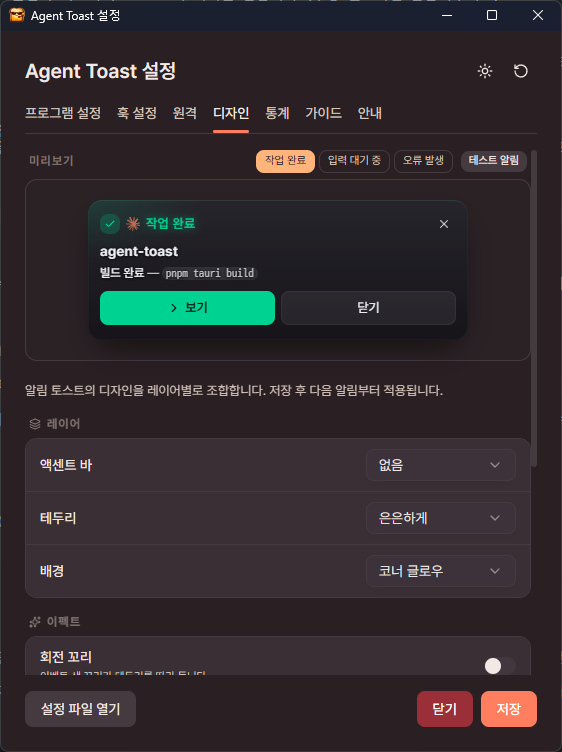
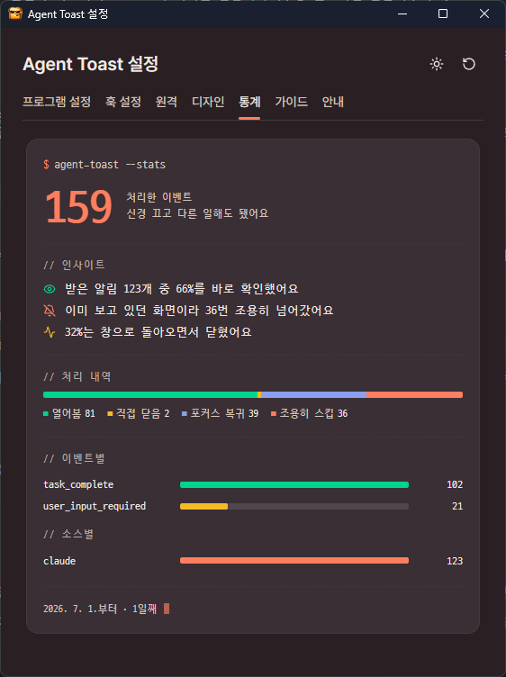
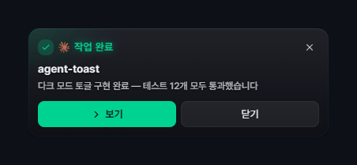

<p align="center">
  <strong>한국어</strong> | <a href="README.en.md">English</a>
</p>

<p align="center">
  
</p>

<h1 align="center">Agent Toast</h1>

<p align="center">
  <strong>터미널 감시는 이제 그만</strong><br>
  에이전트가 필요한 순간 바로 알리고, 클릭하면 곧장 터미널로 돌아갑니다
</p>

<p align="center">
  <a href="https://github.com/hopoduck/agent-toast/releases"></a>
  <a href="https://github.com/hopoduck/agent-toast/blob/master/LICENSE"></a>
  
  
</p>

<p align="center">
  
</p>

## ✨ 주요 기능

- **스마트 알림** - 알림 클릭 → 터미널 즉시 활성화, 터미널 복귀 시 알림 자동 소멸, 이미 포커스 중이면 알림 생략
- **에이전트 메시지 표시** - 알림 본문에 에이전트의 마지막 메시지(권한 요청 시 도구 설명)를 표시하는 옵션
- **15가지 Hook 이벤트** - 작업 완료, 권한 요청, 입력 대기, 세션 시작/종료 등
- **원격 알림** - 원격 Linux 서버의 Claude Code 훅 알림을 데스크톱 토스트로 수신
- **멀티 모니터 지원** - 원하는 모니터의 4코너에 알림 표시, DPI 스케일 대응
- **알림 사운드** - 시스템 알림음으로 이벤트를 놓치지 않음 (설정에서 on/off)
- **라이트/다크 테마** - 시스템 테마를 따라가는 토스트 디자인, 마우스를 올리면 자동 닫힘 일시정지
- **토스트 디자인 커스터마이즈** - 바·테두리·배경·이펙트·밀도(넉넉/컴팩트)와 sans/mono 시스템 폰트를 실시간 미리보기로 조정 (D2Coding 번들 포함)
- **알림 통계** - 표시·클릭·자동 소멸 등 알림 이벤트를 집계해 인사이트로 확인
- **다국어 지원** - 한국어/영어 UI
- **자동 업데이트** - 새 버전 알림 및 원클릭 업데이트

## 🖼️ 스크린샷

|                          토스트 디자인 커스터마이즈                           |                                 알림 통계                                  |
| :----------------------------------------------------------------------------: | :--------------------------------------------------------------------------: |
|  |  |

## 🔌 지원 플랫폼

| 플랫폼                                               | 설명                               |
| ---------------------------------------------------- | ---------------------------------- |
| [Claude Code](https://www.anthropic.com/claude-code) | Anthropic의 AI 코딩 어시스턴트     |
| [Codex CLI](https://openai.com/codex/)               | OpenAI의 터미널 기반 코딩 에이전트 |

## 📥 설치

### Releases에서 다운로드

[**📦 최신 버전 다운로드**](https://github.com/hopoduck/agent-toast/releases/latest)

### 직접 빌드

```bash
# 요구사항: Node.js 18+, pnpm, Rust (MSVC 툴체인)

pnpm install
pnpm tauri build
```

## 🚀 사용법

### 1. 설정 창 열기

```bash
agent-toast.exe --setup
```

또는 시스템 트레이 아이콘 우클릭 → 설정

### 2. 훅 설정

설정 창에서 원하는 이벤트를 활성화하면 자동으로 훅이 등록됩니다.

> 💡 알림 본문에는 기본으로 에이전트의 마지막 메시지(권한 요청 시 도구 설명)가 표시됩니다. 일반 탭의 **에이전트 메시지 사용**을 끄면 각 훅의 고정 문구가 표시됩니다.

| 플랫폼      | 설정 파일                 |
| ----------- | ------------------------- |
| Claude Code | `~/.claude/settings.json` |
| Codex CLI   | `~/.codex/config.toml`    |

## ⚙️ 작동 원리

- Named Pipe로 단일 인스턴스 관리 — 최초 실행 시 앱을 띄우고, 이후 CLI 호출은 파이프로 JSON 전송 후 즉시 종료
- Win32 API로 포커스 변화를 실시간 감지하여 알림 자동 소멸 처리
- 프로세스 트리 탐색으로 `--pid`에서 터미널 창 탐지 정확도 개선

## 🌐 원격 알림 (Linux 서버)

원격 Linux 서버에서 실행하는 Claude Code 훅 알림을 데스크톱 토스트로 받을 수 있습니다.

<details>
<summary><strong>설정 방법 펼치기</strong></summary>

### 1. 데스크톱: HTTP 수신 활성화

설정 창 → **원격 알림** → **HTTP 수신 활성화** 토글 ON. 기본 포트는 `38787`(설정에서 변경 가능), 바인딩 주소는 항상 `0.0.0.0` 입니다.

Windows 방화벽이 처음 허용 여부를 물을 수 있습니다. Tailscale 이나 SSH 포트 포워딩 사용 시 **개인 네트워크** 만 허용해도 충분합니다.

### 2. 서버: `agent-toast-send` 설치 + 훅 등록

```bash
curl -L https://github.com/hopoduck/agent-toast/releases/latest/download/agent-toast-send-linux-$(uname -m) \
  -o ~/.local/bin/agent-toast-send
chmod +x ~/.local/bin/agent-toast-send

agent-toast-send init --url http://<desktop-ip>:38787 --dynamic [--hostname "prod"]
```

- `<desktop-ip>` 는 서버에서 데스크톱에 도달 가능한 주소 (Tailscale, LAN, SSH `-R`). 네트워크 도달성은 사용자 책임이며 앱이 관리하지 않습니다.
- `--dynamic` 은 알림 본문에 에이전트의 마지막 메시지(권한 요청 시 도구 설명)를 표시 (생략 시 고정 문구).
- `--hostname` 은 토스트에 표시되는 라벨 (생략 시 `hostname(1)` 자동 감지).
- 기본 등록 훅: **Stop**(작업 완료), **Notification**(권한 요청). 더 세밀한 커스터마이즈는 서버의 `~/.claude/settings.json` 을 직접 편집하면 됩니다.

해제는 `agent-toast-send uninstall` — agent-toast 관련 훅만 제거하고 다른 훅은 보존합니다.

</details>

## 🌍 글로벌 통계 (익명)

앱은 알림 카운터(표시·클릭·닫힘 횟수)를 익명으로 집계 서버에 업로드해, 전 세계 합계를 통계 탭과 상단 뱃지에 보여줍니다.

- **전송되는 것**: 이벤트·소스별 누적 카운터, 설치 시 생성되는 랜덤 ID
- **전송되지 않는 것**: 호스트명, 파일 경로, 메시지 내용 등 개인 식별 정보 일체
- **끄기**: 설정 → 통계 탭 → "익명 통계 공유" 토글

## 🤔 왜 커스텀 알림 창인가요?

OS 네이티브 토스트는 "알림을 띄우는 것"까지만 합니다. Agent Toast는 알림을 **작업 흐름의 일부**로 만듭니다:

<p align="center">
  
</p>

- **클릭 한 번에 그 터미널로** — 알림을 누르면 알림을 띄운 바로 그 터미널 창이 활성화됩니다
- **돌아오면 알아서 사라짐** — 터미널로 포커스가 돌아오면 알림이 자동으로 닫힙니다
- **필요 없으면 안 뜸** — 이미 그 터미널을 보고 있으면 알림을 생략합니다

네이티브 토스트로는 불가능한, 창 단위로 인지하는 스마트 동작을 위해 전용 알림 창을 씁니다.

## 🔍 다른 알림 도구와 비교

|                               | **Agent Toast**         | [**Toasty**](https://github.com/shanselman/toasty) | [**claude-code-notification**](https://github.com/wyattjoh/claude-code-notification) | **PowerShell 스크립트** | [**ntfy.sh**](https://ntfy.sh) |
| ----------------------------- | ----------------------- | -------------------------------------------------- | ------------------------------------------------------------------------------------ | ----------------------- | ------------------------------ |
| **알림 방식**                 | 커스텀 알림 창          | OS 네이티브 토스트                                 | OS 네이티브 토스트                                                                   | OS 네이티브 토스트      | HTTP 푸시 알림                 |
| **플랫폼**                    | Windows                 | Windows                                            | Windows · macOS · Linux                                                              | Windows                 | 전체 (모바일 포함)             |
| **설치 방식**                 | 인스톨러 / 포터블       | CLI 바이너리                                       | CLI 바이너리                                                                         | 스크립트 복사           | curl 한 줄                     |
| **GUI 설정**                  | ✅ 설정 창 제공          | ❌ CLI만                                            | ❌ CLI만                                                                              | ❌ 수동 편집             | ❌ 수동 편집                    |
| **디자인 커스터마이즈**       | ✅ 바·폰트·밀도 등       | ❌                                                  | ❌                                                                                   | ❌                       | ❌                              |
| **알림 통계**                 | ✅                       | ❌                                                  | ❌                                                                                   | ❌                       | ❌                              |
| **스마트 알림**¹              | ✅                       | ❌                                                  | ❌                                                                                    | ❌                       | ❌                              |
| **알림 클릭 → 터미널 활성화** | ✅                       | ❌                                                  | ❌                                                                                    | ❌                       | ❌                              |
| **멀티 모니터 · 위치 선택**   | ✅ 4코너 + 모니터 선택   | ❌                                                  | ❌                                                                                    | ❌                       | ❌                              |
| **DPI 스케일 대응**           | ✅                       | ❌                                                  | ❌                                                                                    | ❌                       | ❌                              |
| **알림 사운드**               | ✅                       | ❌                                                  | ✅                                                                                    | ❌                       | ✅                              |
| **자동 업데이트**             | ✅                       | ❌                                                  | ❌                                                                                    | ❌                       | ❌                              |
| **원격 서버 알림 수신**²      | ✅ 전용 CLI + HTTP 수신  | ❌                                                  | ❌                                                                                    | ❌                       | ✅                              |
| **모바일 알림**               | ❌                       | ✅ (ntfy 연동)                                      | ❌                                                                                    | ❌                       | ✅                              |
| **다중 AI 도구 지원**         | Claude Code · Codex CLI | Claude · Copilot · Gemini · Codex 등               | Claude Code                                                                          | Claude Code             | 범용                           |
| **언어**                      | Rust + TypeScript       | C++                                                | Rust                                                                                 | PowerShell              | Shell (curl)                   |

> ¹ **스마트 알림**: 터미널이 이미 포커스 중이면 알림 생략 + 터미널 복귀 시 알림 자동 소멸
>
> ² **원격 서버 알림 수신**: 원격 Linux 서버에서 실행 중인 에이전트 훅이 데스크톱에 알림을 띄움 (Toasty의 ntfy 연동은 데스크톱→모바일 발신 전용)

## 🛠️ 기술 스택

<p>
  
  
  
  
</p>

## 📄 라이선스

[MIT License](LICENSE)
